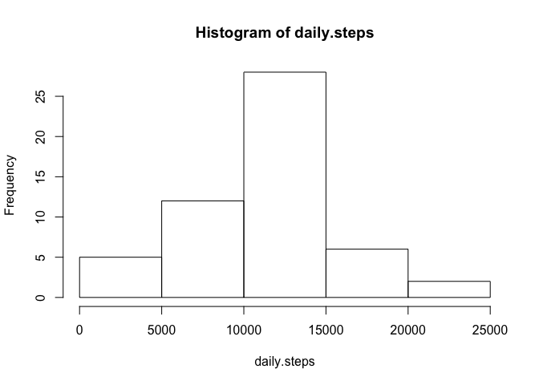
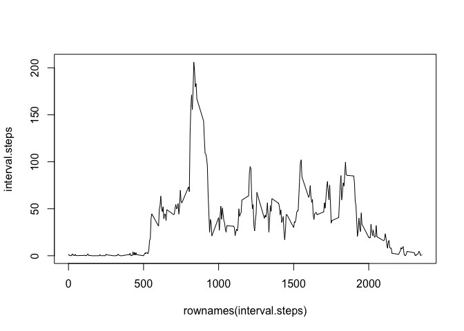
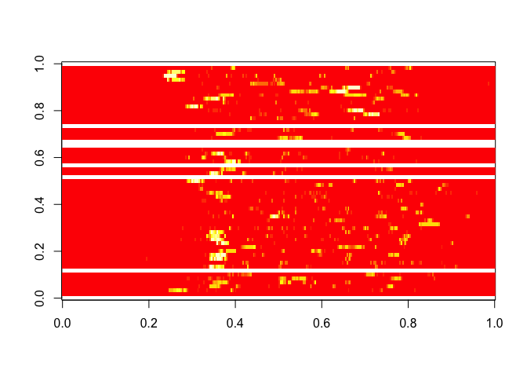
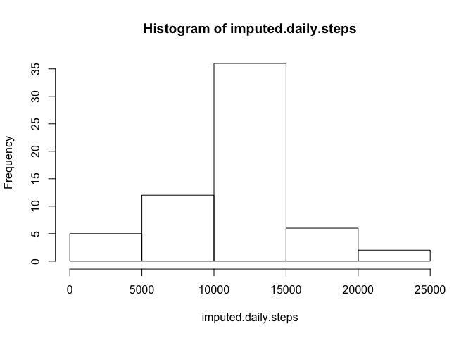

# Reproducible Research: Peer Assessment 1


## Loading and preprocessing the data


```r
activity <- read.csv("activity.csv")
activity$date <- as.Date(activity$date)
```

## What is mean total number of steps taken per day?


```r
daily.steps <- tapply(activity$steps,activity$date,sum)
hist(daily.steps)
```

 

```r
mean.daily.steps <- mean(daily.steps, na.rm = TRUE)
median.daily.steps <- median(daily.steps, na.rm = TRUE)
```

On average, the study subject took 10766.19 steps per day. On the median day, the subject took 10765 steps.

## What is the average daily activity pattern?


```r
interval.steps <- tapply(activity$steps,activity$interval,mean, na.rm=TRUE)
plot(rownames(interval.steps),interval.steps,type="l")
```

 

```r
max.interval.index <- which(interval.steps==max(interval.steps))
max.interval.name <- rownames(interval.steps)[max.interval.index]
```

The daily interval with the greatest average steps was 835.

## Imputing missing values

2304 intervals are missing data.

First let's create a quick visualization of daily patterns. This plots a heatmap with days on the y axis and interval on the x axis. White squares represent missing data, red represents intervals with few steps and yellow represents intervals with more steps. 


```r
library(reshape2)
wide.view <- dcast(activity,interval ~ date, value.var = "steps")
A = as.matrix(wide.view)
rownames(A) <- A[,1]
A = A[,-1]
image(A)
```

 

We can see that some days are completely missing (the horizontal white bars). This would make it difficult to impute missing data purely based on a daily average. From "eyeballing" it, I would also say that there appears to be more of a relationship between interval and activity rather than day and activity. For simplicity, we will replace missing values with the average value across all days for that interval.


```r
# note, this takes advantage of the fact that the dataframe is sorted by date and interval and that
# there are no missing intervals even if the data for those intervals is missing
# since the interval column is just 0-2355 repeated 60 times (60x288 long), R lets us treat a 288
# vector as if it was a 60*288 long vector by automatically repeating it for us.
# It's sloppy and dangerous. dplyr has some better options, I'm just being lazy for now
average <- tapply(activity$steps,activity$interval,mean, na.rm=TRUE)
imputed <- activity
imputed$steps <- ifelse(is.na(imputed$steps),average,imputed$steps)
```


```r
imputed.daily.steps <- tapply(imputed$steps,imputed$date,sum)
hist(imputed.daily.steps)
```

 

```r
imputed.mean.daily.steps <- mean(imputed.daily.steps)
imputed.median.daily.steps <- median(imputed.daily.steps)
```

Using our imputed values, the new average number of daily steps taken was **10766.19**, which is no different from the original value of **10766.19**. The imputed median value was **10766.19** as opposed to **10765**.

It is not surprising that the mean value saw no change as the original calculation removed missing values from the average value computed. In general, adding the average of a set of values to that set of values will not change the average of the set. While in this case, we intruduced new values that were the average of an aggregation across one dimension, then aggregated and averaged over a different dimension, the fact that this did not change the end result is likely due to a mathematical distributed equality law. This occurence should not be treated as a proof of any equality, but such an equality could be investigated and likely proven.

We would not expect to see similar equality laws for the median score, because the calculation of median is not an inherently distributable aggregation. In particular, the median of a set of integers will always be a median value. In our case, using averages as imputed values introduced non integers into our imputed set making it possible to see non integer median values where those were not formerly possible.


## Are there differences in activity patterns between weekdays and weekends?


```r
library(reshape2)
library(ggplot2)
activity$weekday <- factor(ifelse(weekdays(activity$date) %in% c("Sunday", "Saturday"), "weekend", "weekday"))
melted <- melt(activity, id.vars=c("date", "interval", "weekday"), measure.vars="steps")
means <- dcast(data=melted, formula = interval + weekday ~ variable, fun.aggregate=mean, na.rm=TRUE)
qplot(x=interval, y=steps,data=means, facets = weekday~., geom="line")
```

 
